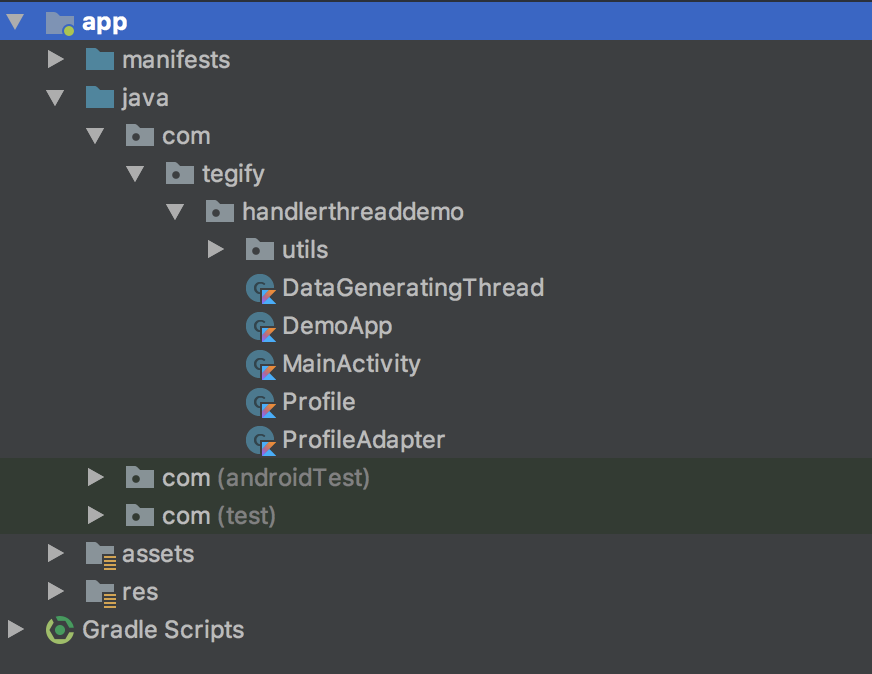
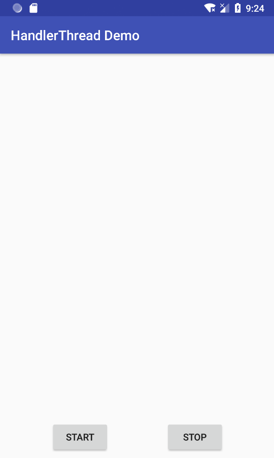
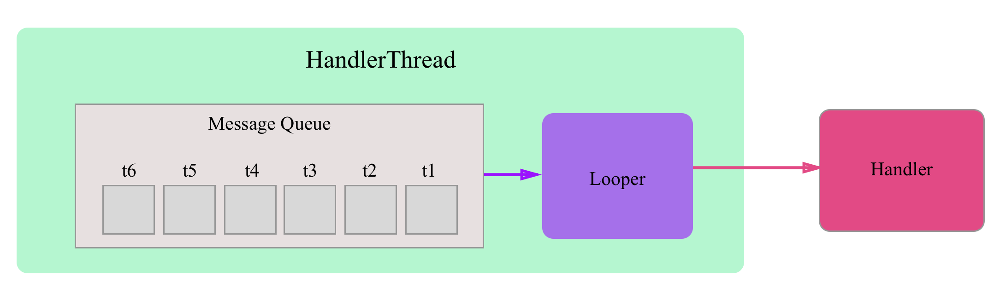
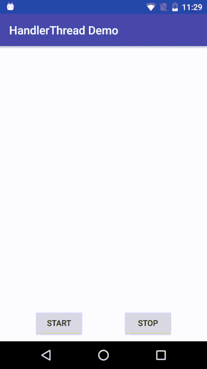

# Threading với HandlerThread trong Android

Sau bài viết này, bạn sẽ học được cách sử dụng HandlerThread để nhận message từ Runnable trong một Activity và giao tiếp với UI Handler để cập nhật dữ liệu lên giao diện (UI).

Sự phản hồi nhanh chóng là một trong những tính năng quan trọng nhất của bất kì ứng dụng nào. Điều này lại càng đặc biệt quan trọng hơn đối với những thiết bị giới hạn về tài nguyên (resource-constrainted devices) như là điện thoại thông minh (smartphones). Ứng dụng phải phản hồi nhanh chóng, mượt mà đối với những tương tác của người dùng để mang lại những trải nghiệm tốt nhất. Cũng vì lý do đó, **lập trình đồng thời (concurrent programming)** trở thành một trong những kỹ năng không thể thiếu đối với bất kỳ lập trình viên nào.

Đối với mọi lập trình viên Android, điều đầu tiên quan trọng nhất cần phải biết đó là tất cả những tương tác của người dùng (user) trên giao diện ứng dụng (User Interface or UI) được thực thi trên cùng một thread được gọi là **main thread** hoặc **UI thread**. Trong thực tế, trên nhiều nền tảng như Swing, AWT, iOS, v.v. cách tiếp cận tốt nhất là chuyển đổi những hoạt động (operation) cần thực hiện trên UI thread thành những thông điệp (message) đến một bộ tiêu thụ (consumer) duy nhất trên UI thread. Trong android, một trong những cách để thực hiện điều này là dùng **HandlerThread**.

Trong bài viết này, bạn sẽ phát triển một ứng dụng nhỏ tên food-ordering cần dùng kỹ thuật lập trình đồng thờic (concurrent programming) để thực thi một số tác vụ. McWenderlich là một ứng dụng cập nhật nhanh chóng ứng food-ordering cho một khách sạn, nó sẽ xử lý những đơn hàng bằng cách chuyển đổi giá từ đô la Mỹ (USD) sang ru-pi (INR) của Ấn Độ. Sau bài này, bạn sẽ học được
- Một số thành phần (components) của Android Framework: **Handler**, **Message**, **Runnable**, **Looper** và **MessageQueue**.
- Vai trò của **HandlerThread** trong framework.
- Hiện thực một **HandlerThread** để cập nhật giao diện (UI).
- So sánh HandlerThread với một số tools khác như **AsyncTask**, **Service** và **IntentService**.

>Chú ý: Để đọc hiểu và tiếp thu được kiến thức trong bài viết này đòi hỏi bạn phải có kiến thức cơ bản về lập trình Android, Kotlin và có chút ít hiểu biết về luồng (thread) và lập trình đa luồng (multi-threading).

## Bắt đầu
Trong quá trình viết bài, chúng tôi chỉ đưa và một số đoạn code mà chúng tôi cho là quan trọng và để minh hoạ cho những điều mà đang được đề cập tới. Do vậy, để có thể dễ dàng tiếp thu và theo dõi mã nguồn (source code) đầy đủ của bài viết này, bạn đọc có thể tải mã nguồn đầy đủ trên GitHub [HandlerThreadDemo](https://github.com/Tegify/HandlerThreadDemo) hoặc đơn giãn gõ:

```sh
git clone https://github.com/Tegify/HandlerThreadDemo.git
```

Sau khi tải mã nguồn của bài viết về, bạn mở project lên bằng Android Studio sẽ thấy cấu trúc thư mục như sau:



Giới thiệu qua các lớp (classes) trong mã nguồn (source code):
- **Profile**: là model chứa dữ liệu để hiển thị lên giao diện, bao gồm định dạnh người dùng (userId), hình đại diện (avatar) và tên hiển thị (dipsplay name).

- **ProfileAdapter**: là Adapter chứa danh sách profile *RecyclerView* dùng để hiện thị một danh sách profile bao gồm hình đại diện (avatar) và tên hiển thị (display name).

- **DataGeneratingThread**: là lớp kế thừ từ HandlerThread dùng để phát sinh ngẫu nhiên dữ liệu profile từ background thread và gởi dữ liệu lên UI thread để hiện thị lên giao diện người dùng.

- **MainActivity**: là **Activity** dùng để hiển thị dữ liệu được gởi lên từ background thread.

Sau khi chạy ứng dụng từ Android Studio, bạn sẽ thấy màn hình  sau: 



Trên màn hình bạn sẽ thấy có hai nút (buttons) là **Start** và **Stop**.
- Nút **Start** để bạn bắt đầu phát sinh dữ liệu ngẫu nhiên từ dưới dùng DataGeneratingThread.
- Nút **Stop** để bạn dừng phát sinh dữ liệu ngẫu nhiên từ DataGeneratingThread.

## HandlerThread và các thành phần (Components) liên quan:
- **Handler**: Đây là một trong những thành phần rất quan trọng của framework. Nó sẽ được liên kết với một Looper ứng với một thread riêng biệt và cung cấp cho chúng ta những phương thức để gởi các thông điệp (messages) hoặc thực thì một tác vụ (task) bằng cách *post* một đối tượng **Runnable** trên thread này.

- **Message**: là đối tượng dùng để chứa các thông tin mà bạn muốn xử lý trên một thread cụ thể.

- **Runnable**: là một giao diện (Interface) để trừu tượng hoá các hành động mà bạn muốn thực hiện trên một thread cụ thể. 

- **MessageQueue**: những thông điệp (Message) được gởi tới một thread thông qua **Handler** sẽ được đưa vào một hàng đợi chính là MessageQueue và sẽ được xử lý tuần tự trên thread này.

- **Looper**: là một vòng lặp dùng để kiểm tra xem *hàng đợi thông điệp (MessageQueue)* có chứa *thông điệp (Message)* cần xử lý hay không. Nếu có, **Looper** sẽ lấy thông điệp ra khỏi hàng đợi và gởi tới cho **Handler** xử lý. Mỗi thread chỉ có duy nhất một Looper.



## Cách tạo HandlerThread 
Trong Android có vài cách để tạo **HandlerThread** làm background thread. Trong bài viết này, chúng tôi sẽ hướng dẫn bạn cách kế thừa HandlerThread. 

Trong Android Studio, bạn click chuột phải vào package gốc **com.tegify.handlerthreaddemo** và chọn **New > Kotlin File/Class**. Tiếp theo, trong hộp thoại hiện ra bạn đặt tên lớp là **DataGeneratingThread** và sau đó chọn *Kind* là **Class**.

Sau khi lớp được tạo ra, bạn cho lớp **DataGeneratingThread** này kế thừa từ HandlerThread như sau: 

```kotlin
class DataGeneratingThread : HandlerThread("DataGeneratingThread") {
}
```

Vì hàm tạo của HandlerThread bắt buộc có 1 tham số **String** dùng làm tên của thread, do đó đoạn code trên truyền vào chuỗi "DataGeneratingThread" vào hàm tạo của lớp HandlerThread để làm tên cho thread này. 

Tuy nhiên, để DataGeneratingThread có thể gởi dữ liệu lên UI Thread, bạn cần truyền vào hàm tạo của lớp này một UI Handler (được định nghĩa trong MainActivity) dùng để nhận dữ liệu và cập nhật lên giao diện thông qua **MainActivity**. Do vậy, lớp DataGeneratingThread sẽ thêm tham số trong hàm tạo như sau:

```kotlin
class DataGeneratingThread(private val uiHandler: MainActivity.UIHandler) : HandlerThread("DataGeneratingThread") {
}
```

## Tạo Handler để xử lý cho HandlerThread
Trong lớp **DataGeneratingThread** đã tạo ra ở trên, bạn khai báo thêm thuộc tính **handler** như sau:

```kotlin
class DataGeneratingThread(private val uiHandler: MainActivity.UIHandler) : HandlerThread("DataGeneratingThread") {

    private var handler: Handler? = null

}
```

Để khởi tạo thuộc tính **handler** vừa tạo ra, bạn thêm phương thức ghi đè (override) **onLooperPrepared()** và khởi tạo handler trong này. Phương thức này theo **onLooperPrepared()** theo [tài liệu](https://developer.android.com/reference/android/os/HandlerThread) định nghĩa là để cho lớp con kế thừa từ HandlerThread ghi đè để thực hiện một số thao tác khởi tạo trước khi Looper của HandlerThread được chạy. Đây là nơi tốt nhất để chúng ta khởi tạo thuộc tính handler ở trên.

```kotlin
class DataGeneratingThread(private val uiHandler: MainActivity.UIHandler) : HandlerThread("DataGeneratingThread") {

    private var handler: Handler? = null

    override fun onLooperPrepared() {
        super.onLooperPrepared()
        handler = getHandler(this.looper)
    }

    private fun getHandler(looper: Looper): Handler {
        return object: Handler(looper) {
            override fun handleMessage(msg: Message?) {
                val message = uiHandler.obtainMessage()
                message.obj = msg?.obj
                message.sendToTarget()
            }
        }
    }
    
    ...
}
```

Phương thức **getHanlder()** ở trên dùng [biểu thức object (Object Expression)](https://kotlinlang.org/docs/reference/object-declarations.html) để định nghĩa một lớp nặc danh (annonymous) kế thừa từ Handler và ghi đè phương thức **handleMessage()** để xử lý thông điệp (Message) nhận tự **Looper**. Ở đây, logic của phương thức này chỉ đơn giãn là gởi thông điệp (Message) từ thread này (DataGeneratingThread) lên UI thread.

## Tạo Runnable để sinh dữ liệu ngẫu nhiên cho DataGeneratingThread
Để phát sinh dữ liệu ngẫu nhiên cho **DataGeneratingThread** bạn thêm vào lớp này khai báo sau:

```kotlin
class DataGeneratingThread(private val uiHandler: MainActivity.UIHandler) : HandlerThread("DataGeneratingThread") {

    ...

    private val generator = object: Runnable {
        override fun run() {
            val msg = handler?.obtainMessage()
            msg?.obj = DataProvider.random()
            msg?.sendToTarget()
            handler?.postDelayed(this, 100)
        }
    }
    
    ...
}
```

Ở đây, chúng ta lại tiếp tục vận dụng biểu thức object để tạo ra một thuộc tính là **generator** hiện thực **Runnable**. Thuộc tính **generator** này đóng vai trò phát sinh dữ liệu ngẫu nhiên thông qua **DataProvider.random()**. Dữ liệu profile sau khi được sinh ra sẽ được đính kèm vào đối tượng **Message** thông qua **Message.obj** rồi gởi tới hàng đợi (MessageQueue) của **DataGeneratingThread** thông qua lệnh **msg?.sendToTarget()**. Cuối cùng, nó lặp lại tác vụ này bằng cách trì hoãn (delay) 100 milliseconds bằng lệnh **handler?.postDelayed(this, 100)**.

Sau khi định nghĩa tác vụ **generator** ở trên, việc còn lại là chúng ta sẽ phải dùng dùng nó như thế nào. Quay lạy màn hình bắt đầu của ứng dụng, bạn sẽ thấy hai nút (buttons) **"Start"** và **"Stop"** là hai hành động dùng để chạy và dừng việc phát sinh dữ liệu ngẫu nhiên. Do đó, chúng ta sẽ định nghĩa hai phương thức tương ứng cho hai hành động này trong lớp **DataGeneratingThread** như sau:

```kotlin
class DataGeneratingThread(private val uiHandler: MainActivity.UIHandler) : HandlerThread("DataGeneratingThread") {

    @Volatile
    private var isGenerating = false

    private var handler: Handler? = null

    private val generator = object: Runnable {
        override fun run() {
            val msg = handler?.obtainMessage()
            msg?.obj = DataProvider.random()
            msg?.sendToTarget()
            handler?.postDelayed(this, 100)
        }
    }
    
    public fun startGenerating() {
        handler?.apply {
            if (!isGenerating) {
                post(generator)
                isGenerating = true
            }
        }
    }

    public fun stopGenerating() {
        handler?.apply {
            removeCallbacks(generator)
            isGenerating = false
        }
    }
    
    ...
}
```

## Khởi tạo và cập nhật giao diện
Sau khi đã hoàn tất lớp **DataGeneratingThread** ở trên, việc tiếp theo cần làm là sử dụng lớp này.

Mở **MainActivity** từ package **com.tegify.handlerthreaddemo** và khai báo các thuộc tính sau:

```kotlin
    private lateinit var uiHander: UIHandler
    private lateinit var dataGeneratingThread: DataGeneratingThread
```

Sau đó, khai báo các phương thức để khởi tạo các thuộc tính này:

```kotlin
 private fun initBackgroundThread() {
        uiHander = UIHandler()
        uiHander.attach(this)

        dataGeneratingThread = DataGeneratingThread(uiHander)
        dataGeneratingThread.start()
    }

    private fun stopBackgroundThread() {
        dataGeneratingThread.stopGenerating()
        dataGeneratingThread.quit()
    }
```

Phương thức **initBackgroundThread()** dùng để khởi tạo và chạy DataGeneratingThread. Phương thức **stopBackgroundThread()** dùng để dừng việc phát sinh dữ liệu và dừng background thread này khi activity không còn hiển thị trên màn hình để đảm bảo ứng dụng không lãng phí tài nguyên và chạy một thread ngầm không cần thiết.

Sau khi khai báo hai thuộc tính và phương thức ở trên, bạn ghi đè hai phương thức của ctivity trong **MainActivity** là **onStart()** và **onStop()** để thực hiện khởi tạo và giải phóng như sau:

```kotlin

    override fun onStart() {
        super.onStart()
        initBackgroundThread()
    }

    override fun onStop() {
        stopBackgroundThread()
        super.onStop()
    }
```

Tiếp theo, chúng ta sẽ khai báo lớp UIHandler sử dụng để khai báo ở trên như sau:

```kotlin
class UIHandler : Handler() {

        private var activityRef: WeakReference<MainActivity>? = null

        fun attach(activity: MainActivity) {
            activityRef = WeakReference(activity)
        }

        override fun handleMessage(msg: Message?) {
            val profile = msg?.obj as Profile
            activityRef?.get()?.onNewProfile(profile)
        }
    }
```

Cuối cùng, để **UIHandler** có thể cập nhật dữ liệu lên giao diện, trong **MainActivity** chúng ta khai báo phương thức **onNewProfile()** như sau:

```kotlin
fun onNewProfile(profile: Profile?) {
    profileAdapter.add(profile)
    if (profileAdapter.itemCount > 0) {
        profileList.smoothScrollToPosition(profileAdapter.lastPosition())
    }
}
```

Phương thức này dùng để thêm profile nhận được từ UI Thread vao ProfileAdapter. Sau khi thêm thành công vào trong adapter, tự động trượt (scroll) tới vị trí cuối cùng của danh sách. Kết quả cuối cùng sẽ như sau:



Cảm ơn các bạn đã quan tâm bài viết của chúng tôi. Hi bài viết này sẽ mang lại cho các bạn những kiến thức hữu ích. Chúng tôi cũng luôn muốn lắng nghe những ý kiến đóng góp và chia sẻ của các bạn để có thễ cải thiện những điểm thiếu xót và hạn chế để có thể viết những bài khác tốt hơn. Mọi ý kiến đóng góp các bạn có thể gởi về email tech@tegify.com.

